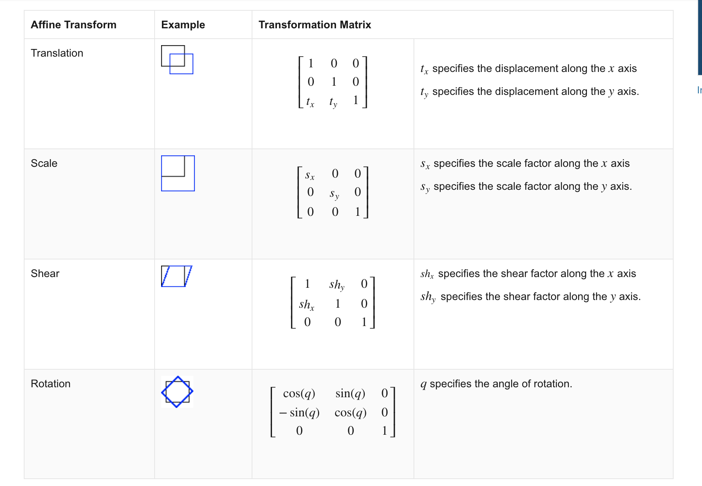
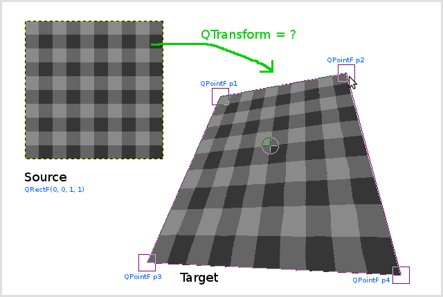

## Title: Perspective Transformation for Lane Detection

이번 포스트에서는 Lane detection을 위해서 영상의 시점을 전환하는 방법을 다룰 것입니다.  
이를 위해서 필요한 개념은 Perspective Transformation이라는 것입니다. 이것은 다양한 2D Image Transformation 방식 중에 하나입니다.  
여기서 2D Image Transformation은 다음 표와 같은 행렬 변환을 의미합니다. 

<p align="center"></p> <br>

*출처: Matlab 공식 홈페이지 - Affine Transformation 문서*

대충 아시는 분들도 계실텐데, Affine Transformation은 2D 이미지 변환중에서도 그 기하학적인 성질들을 보존하는 변환입니다. 
그렇다면 Perspective Transformation은 무엇일까요? 우선 명확한 정의를 먼저 짚고 넘어갑시다. 
> ##### Perspective Transformation (Homography)
> ##### Definition: 평면 물체의 경우에는 3D 공간에서 2D image로 임의의 변환이 가능합니다. 이때 두 이미지 사이의 변환 관계를 homography로 표현할 수 있는 수단이 존재합니다. 이를 이용한 변환이 Perspective Transformation입니다.

이를 조금 더 직관적으로 해석하자면, *어떤 2D 평면의 사각형을 임의의 다른 사각형으로 mapping할 수 있는 변환*이 Homography입니다. 이는 어떻게 보면 Affine Transformation의 일반화라고 할 수 있습니다. 조금 더 직관적인 이해를 위해 다음 사진과 같은 변환을 진행한다고 생각하시면 편하실 것 같습니다.

<p align="center"></p> <br>

이 사진과 같이 정 사각형이 이상한 사각형을 바뀌는 것을 보실 수 있습니다. 이것이 Perspective Transformation의 전과 후의 모습입니다.
한마디로, 원본 이미지의 4개의 점을 통한 사각형 영역을 임의의 사각형 영역으로 기하학적인 변환을 가하는 것입니다.

이를 수학적으로 표현하여 구체화 해보면 다음과 같이 쓸 수 있습니다.

```math
w
\begin{bmatrix}
    x' \\
    y' \\
    1
\end{bmatrix}
=
\begin{bmatrix}
    h_{11} & h_{12} & h_{13} \\
    h_{21} & h_{22} & h_{23} \\
    h_{31} & h_{32} & 1 
\end{bmatrix}
\begin{bmatrix}
    x \\
    y \\
    1 
\end{bmatrix}
```
```math
H = 
\begin{bmatrix}
    h_{11} & h_{12} & h_{13} \\
    h_{21} & h_{22} & h_{23} \\
    h_{31} & h_{32} & 1 
\end{bmatrix}
```

이때, 위의 $3*3$ 행렬을 구한다면 우리는 어떤 Image의 사각형 영역을 다른 사각형으로 변환할 수 있다는 것입니다.  
이때 이 행렬 $H$를 구하는 것은 $h_{11}$ ~ $h_{32}$의 8개의 parameter를 구하는 것과 마찬가지일 것입니다. 이때, 정의를 그대로 이용하여, 우리는 4쌍의 $(x, y)$, $(x', y')$를 저 식에 대입하여 만족하는 행렬 $H$를 구하는 것이 우리의 목표라고 생각할 수 있습니다. 그렇다면 우리는 다음과 같이 방정식을 작성할 수 있습니다.
<br>

```math
wx' = h_{11}x + h_{12}y + h_{13}
\tag{1}
```   
```math
wy' = h_{21}x + h_{22}y + h_{23}
\tag{2}
```  
```math
w = h_{31}x + h_{32}y + h_{33}
\tag{3}
```  

이렇게 대응되는 4개의 점쌍으로 행렬 $H$를 구할 방법은 여러가지가 있을 수 있습니다. 그 중에서 가장 대표적인 방법을 소개해 보도록 하겠습니다.
우선 방정식 (1)과 (3)을 나누고, (2)와 (3)을 나누면 우리는 $x'$와 $y'$를 알 수 있다.

```math
x' = \frac{h_{11}x + h_{12}y + h_{13}}{h_{31}x + h_{32}y + h_{33}} \newline
\newline
y' = \frac{h_{21}x + h_{22}y + h_{23}}{h_{31}x + h_{32}y + h_{33}}
```
이를 잘 정리하면 다음과 같이 식의 형태를 바꿀 수 있다.

```math
x' = h_{11}x + h_{12}y + h_{13} - h_{31}xx' - h_{32}x'y \newline
y' = h_{21}x + h_{22}y + h_{23} - h_{31}xy' - h_{32}yy'
```

그렇다면 우리는 행렬 $H$의 원소들을 구해야하고 4개의 점 쌍 $(x, y)$, $(x', y')$을 알고 있으니 방정식의 형태를 다음과 같은 형식으로 바꿀 수 있다는 것을 의미한다.

```math
\begin{bmatrix}
    x_1' \\
    y_1' \\
    x_2' \\
    y_2' \\
    x_3' \\
    y_3' \\
    x_4' \\
    y_5' \\
\end{bmatrix}
=
\begin{bmatrix}
    x_1 & y_1 & 1 & 0 & 0 & 0 & -x_1x_1' -x_1'y_1 \\
    0 & 0 & 0 & x_1 & y_1 & 1 & -x_1y_1' -y_1'y_1 \\
    x_2 & y_2 & 1 & 0 & 0 & 0 & -x_2x_2' -x_2'y_2 \\
    0 & 0 & 0 & x_2 & y_2 & 1 & -x_2y_2' -y_2'y_2 \\
    x_3 & y_3 & 1 & 0 & 0 & 0 & -x_3x_3' -x_3'y_3 \\
    0 & 0 & 0 & x_3 & y_3 & 1 & -x_3y_3' -y_3'y_3 \\
    x_4 & y_4 & 1 & 0 & 0 & 0 & -x_4x_4' -x_4'y_4 \\
    0 & 0 & 0 & x_4 & y_4 & 1 & -x_4y_4' -y_4'y_4 \\
\end{bmatrix}
\begin{bmatrix}
    h_{11} \\
    h_{12} \\
    h_{13} \\
    h_{21} \\
    h_{22} \\
    h_{23} \\
    h_{31} \\
    h_{32} \\
\end{bmatrix}
```

이런 선형 방정식을 Inverse Matrix를 구해서 풀 수도 있고, 가우스 소거법을 통해서도 풀 수 있다. 방법은 여러가지이다. 

### C++ Code
---------------------------------------------------------------------
``` c++
// Perspective Transformation을 진행하는 함수.
// Points 2는 다음과 같이 초기화 되어 있음
// (0,0), (W,0), (0, H), (W, H)

void Wrap(Mat Img, Mat &result, vector<Point2f> &pts, int W, int H, bool inv)
{
    Point2f pts1[4];
    for (int i = 0; i < 4; i++)
    {
        pts1[i] = pts[i];
    }
    Mat Perspective;
    // 4개의 점 쌍을 통해서 Perspective 행렬을 구하는 부분. 
    if (inv)Perspective = getPerspectiveTransform(pts2, pts1);
    else Perspective = getPerspectiveTransform(pts1, pts2);

    // 그것을 실제 영상에 반영하여 변환 결과를 받아내는 부분
    warpPerspective(Img, result, Perspective, Size(W, H));
}

```

이것에 대한 전문 소스코드는 깃헙에서 마저 확인하실 수 있습니다.