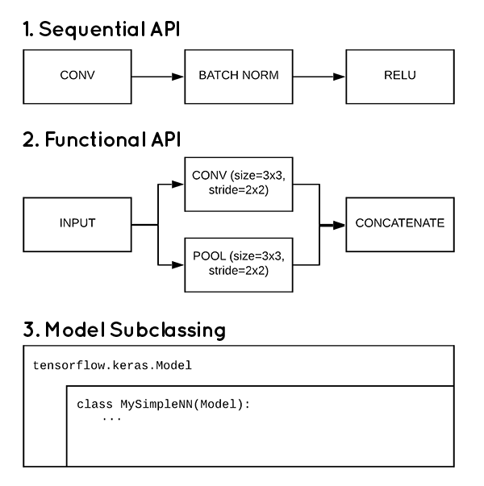

## Title: Neural Network Study (2) - Fully Connnected Neural Network Part. B

*본 포스트는 Hands-on Machine learning 2nd Edition, CS231n, Tensorflow 공식 document를 참조하여 작성되었음을 알립니다.*

###### Index  

1. ~~Basic of Neural Network~~  
2. ~~Definition of Fully Connected Neural Network(FCNN)~~
3. ~~Feed Forward of FCNN~~
4. ~~Gradient Descent~~
5. ~~Back Propagation of FCNN~~
6. Partice(+ 부록 Hyper parameter tuning)

<br>

#### 6. Partice(+ 부록 Hyper parameter tuning)
-------------------------------------------------------

자 실습 시간이다. 왜 실습을 Part. B로 뺐느냐? FCNN이 뭐 할게 있다고?
뭐 할게 있겠다. Tensorflow 2가 대충 어떻게 이루어 졌는지 설명하기 위해 분량 조절을 위해서 뺀것이다.
무엇보다 Part. A 쓰는데 수식을 너무 많이 써서 힘들어서 분리했다. ~~Tlqkf~~
자, 우선 실습에 들어가기에 앞서, TF 2를 애정하는 나로써는 앞으로 이 스터디 포스트에 작성될 대부분의 소스코드를 꿰뚫는 구현 체계를 먼저 설명하고 넘어가겠다.
다음 사진을 보자.

<p align="center"></p>

*출처: pyimagesearch blog: [링크](https://www.pyimagesearch.com/2019/10/28/3-ways-to-create-a-keras-model-with-tensorflow-2-0-sequential-functional-and-model-subclassing/)*

위 그림에서 필자는 대부분의 코드를 **Model Subclassing** 방식으로 구현할 것이다. 구현 하면서 설명할 터이니 잘 따라와 주기를 바란다.
여기서부터는 대학교 강의 수준의 **객체지향프로그래밍** 지식을 갖추지 않으면 읽기 힘들 수 있다. "상속", "오버라이딩"의 개념이라도 살펴보고 오자.

###### 6-1. Model Subclassing
----------------------------------------------------------
우선 준비한 소스부터 보고 시작하자.
*file: model/FCNN1.py*
```python
from tensorflow import keras
import numpy as np

class FCNN(keras.Model):
    def __init__(self, _units = [56, 56], _activation = ['relu', 'relu'], **kwargs):
        super().__init__(**kwargs)
        self.Hidden1 = keras.layers.Dense(units=_units[0], activation=_activation[0], kernel_initializer="normal")
        self.Hidden2 = keras.layers.Dense(units=_units[1], activation=_activation[1], kernel_initializer="normal")
        self._output = keras.layers.Dense(units=10, activation="softmax")
    
    def call(self, Input):
        hidden1 = self.Hidden1(Input)
        hidden2 = self.Hidden2(hidden1)
        Output = self._output(hidden2)
        return Output
```
자, 별거 없다. keras를 써봤다면 뭔지 바로 감이 올 것이다.
이 부분에 대해서는 함수에 대한 설명보다는 class에 대한 설명을 해야할 것 같다. 바로 FCNN class가 상속을 받은 부모 클래스인 keras.Model 클래스에 관해서이다.

keras.Model class는 케라스에서 Deep learning을 진행하는 모델을 정의해주는 class이다. 우리가 이미 존재하는 layer를 가져다가 특정 순서로 연산을 진행하는 graph를 만들어 내기 위한 class이다. 하지만 그렇게 어렵게 생각하지 말자. 사용하는 것을 보면 바로 답이 나온다.

여기서는 생성자와 call이라는 함수를 오버라이딩을 통해서 사용자가 재 정의를 해서 사용한다. call은 우리가 구현하고자 하는 model이 feed forward를 진행할때 호출되는 함수이다. 생성자는 사용할 폭이 넓다. 여기서는 model을 구성하는 layer를 정의하는데 사용하였는데, 꼭 그 역할만 할 필요는 없는 것이다.

가타부타 말이 많았는데, 실제 어떻게 동작을 시키는가?

*file: train_MNIST.py*
```python
from model.FCNN1 import FCNN
from tensorflow import keras
import tensorflow as tf
import numpy as np

mnist = keras.datasets.mnist

(train_img, train_labels), (test_img, test_labels) = mnist.load_data()

train_img, test_img = train_img.reshape([-1, 784]), test_img.reshape([-1, 784])

train_img = train_img.astype(np.float32) / 255.
test_img = test_img.astype(np.float32) / 255.

model = FCNN()
model.compile(optimizer='adam', loss='sparse_categorical_crossentropy', metrics=["accuracy"])
model.fit(train_img, train_labels, batch_size = 32, epochs = 15, verbose = 1, validation_split = 0.3)

model.evaluate(test_img, test_labels, verbose=2)
```
간단하다. keras.Model class를 상속 받았으니, 그곳에 있는 기본 함수들을 모두 사용할 수있다. fit method로 학습을 진행하고 evalute로 test데이터로 모델을 평가한다. 
이는 기존에 keras의 사용법과 별반 다른게 없다.

여기까지는 쉽다. 하지만 이러고 끝낼거면 시작도 하지 않았다.

다음을 진짜 자세하게 설명할 것이다.

*file: model/layer.py*
```python
import tensorflow as tf
from tensorflow import keras

# Weight Sum을 진행하는 Layer를 정의하는 예제 1
class WeightSum(keras.layers.Layer):
    def __init__(self, units=32, input_dim=32, trainable=True, name=None, dtype=None, dynamic=False, **kwargs):
        super().__init__(trainable=trainable, name=name, dtype=dtype, dynamic=dynamic, **kwargs)
        # tf.Variable을 활용하는 예시
        # 가중치 행렬을 초기화 하기 위한 객체
        w_init = tf.random_normal_initializer()
        # 가중치 행렬을 tf.Variable로 정의함. 당연히 학습해야하니 training parameter를 true로 둠.
        self.Weight = tf.Variable(
            initial_value = w_init(shape=(input_dim, units), dtype="float32"),
            trainable = True
        )
        b_init = tf.zeros_initializer()
        # 위랑 같음. 별반 다를거 X
        self.Bias = tf.Variable(
            initial_value = b_init(shape=(units, ), dtype="float32"),
            trainable = True
        )
        # add_weight를 활용하는 예시 - Short Cut
        '''
        # 이는 keras.layers.Layer의 method 중에서 add_weight를 사용하는 방법임. 
        # 주로 training을 시키기 위한 행렬을 이렇게 선언해서 나중에 편하게 불러오기 위한 목적이 큼. 
        self.Weight = self.add_weight(
            shape=(input_dim, units), initializer="random_normal", trainable=True
        )
        self.Bias = self.add_weight(shape=(units,), initializer="zeros", trainable=True)
        '''
    
    def call(self, Input):
        # 행렬 곱을 위한 tf 함수임. 별거 없음
        # 그냥 U = WZ + B 구현한거. 
        return tf.matmul(Input, self.Weight) + self.Bias

# Weight Sum을 진행하는 Layer를 정의하는 예제 2
class WeightSumBuild(keras.layers.Layer):
    def __init__(self, _units = 32, trainable=True, name=None, dtype=None, dynamic=False, **kwargs):
        super().__init__(trainable=trainable, name=name, dtype=dtype, dynamic=dynamic, **kwargs)
        self.units = _units
    
    def build(self, input_dim):
        # 이 함수는 밑에서 자세히 설명함.
        self.Weight = self.add_weight(
            shape=(input_dim[-1], self.units),
            initializer = "random_normal",
            trainable= True
        )

        self.Bias = self.add_weight(
            shape = (self.units,),
            initializer = "random_normal",
            trainable = True
        )
    
    def call(self, Input):
        # 상기 동일.
        return tf.matmul(Input, self.Weight) + self.Bias
```
위의 2개의 class는 하는 짓거리가 완벽하게 똑같다. 하지만 하는 짓거리는 같은데 아주 치명적인 부분이 조금 다르다. 바로 build 함수의 overwritting이다.

```python
#                입력 벡터/텐서의 크기를 받음
def build(self, input_dim):
    # 그에 따라서 Weight와 Bias의 차원을 결정함.
    # 물론, Bias는 차이가 없을 지언정, Weight는 크게 차이가 나게 된다.
    self.Weight = self.add_weight(
        shape=(input_dim[-1], self.units),
        initializer = "random_normal",
        trainable= True
    )

    self.Bias = self.add_weight(
        shape = (self.units,),
        initializer = "random_normal",
        trainable = True
    )
```
이 함수는 call이 호출되기 전에 무조건 실행되는 함수라고 생각하면 된다. 즉, 호출하기 전에 Weight를 정의하는 것이다. 즉, 입력 벡터의 크기에 따라 모델의 형태가 알아서 바꾸게 해줄 수 있는 것이다. 이는 Image를 처리할때 이점이 될 수 있다.
Image를 학습시킬때, 이러한 처리가 없으면 이미지를 전부 동일한 크기로 만들어 주어야 한다. 하지만 build 함수를 정의해서 그때 그때 입력 벡터/텐서에 따라 커널을 수정해 주면 굳이 그럴 필요가 없다. 전처리 비용이 줄어드는 것이다. 

그리고, 이제 이를 학습시키기 위한 코드를 보도록 하자.

*file: train_MNIST_2.py*
```python
import tensorflow as tf
import numpy as np
from tensorflow import keras
from model.FCNN2 import FCNN

EPOCHS = 15
LR = 0.01
BatchSize = 32

# 이미지 불러오기
mnist = keras.datasets.mnist
(train_img, train_labels), (test_img, test_labels) = mnist.load_data()

# 필요한 전처리
train_img, test_img = train_img.reshape([-1, 784]), test_img.reshape([-1, 784])
train_img = train_img.astype(np.float32) / 255.
test_img = test_img.astype(np.float32) / 255.

# Train-Validation Split
validation_img = train_img[-18000:]
validation_label = train_labels[-18000:]
train_img = train_img[:-18000]
train_labels = train_labels[:-18000]

# Train Data의 규합. & Batch 별로 쪼갬
train_dataset = tf.data.Dataset.from_tensor_slices((train_img, train_labels))
train_dataset = train_dataset.shuffle(buffer_size=1024).batch(BatchSize)

# Validation Data의 규합 & Batch 별로 쪼갬
validation_dataset = tf.data.Dataset.from_tensor_slices((validation_img, validation_label))
validation_dataset = validation_dataset.batch(BatchSize)

# Optimizer & Loss Function 정의
optimizer = keras.optimizers.Adam(learning_rate=LR)
loss_function = keras.losses.SparseCategoricalCrossentropy(from_logits=True)

# 학습이 잘 되고 있나 확인하기 위한 지표를 확인하기 위함.
train_accuracy = keras.metrics.SparseCategoricalAccuracy()
val_acc_metric = keras.metrics.SparseCategoricalAccuracy()

model = FCNN()

# Custom Training을 위한 반복문
for epoch in range(EPOCHS):
    print("Epoch %d start"%epoch)
    for step, (x_batch, y_batch) in enumerate(train_dataset):
        with tf.GradientTape() as tape:
            # Model의 Feed Forward
            logits = model(x_batch, training=True)
            # Feed Forward 결과를 바탕으로 Loss를 구함
            loss_val = loss_function(y_batch, logits)
        # 위의 과정을 바탕으로 gradient를 구함
        grad = tape.gradient(loss_val, model.trainable_weights)
        # Optimizer를 통해서 Training Variables를 업데이트
        optimizer.apply_gradients(zip(grad, model.trainable_weights))
        # Batch 별로 Training dataset에 대한 정확도를 구함.
        train_accuracy.update_state(y_batch, logits)
        if step % 500 == 0 :
            print("Training loss at step %d: %.4f"%(step, loss_val))
    # 정확도를 규합해서 출력
    train_acc = train_accuracy.result()
    print("Training acc over epoch: %.4f" % (float(train_acc),))
    train_accuracy.reset_states()

    # Validation을 진행함.
    for x_batch_val, y_batch_val in validation_dataset:
        # Validation을 위한 Feed Forward
        val_logits = model(x_batch_val, training = False)
        # Batch 별로 Validation dataset에 대한 정확도를 구함
        val_acc_metric.update_state(y_batch_val, val_logits)
    # 구한 정확도를 규합하여 출력함.
    val_acc = val_acc_metric.result()
    print("Validation acc: %.4f" % (float(val_acc),))
    val_acc_metric.reset_states()
```
이는 TF2에서 추가된 tf.GradientTape를 통해서 사용자 정의 학습 루프를 만든 것이다. 각 줄마다 주석을 달아 놓았으니 Part. A의 내용을 숙지했다면 그렇게 어렵지 않게 알아들을 수 있을 것이다. 

이제, 한가지 의문이 든다. 그렇다면 위의 Hyper parameter들을 변화시켜가면서 model을 최적화 하려면 노가다 밖에 답이없는건가? 답은 아니다. 이번에는 맛보기만 보여줄 것이다. 이는 scikit learn의 RandomizedSearchCV를 통해서 확인할 수 있다.

*file: RandomSearch.py*
```python
from tensorflow import keras
from scipy.stats import reciprocal
from sklearn.model_selection import RandomizedSearchCV
import numpy as np

mnist = keras.datasets.mnist
(train_img, train_labels), (test_img, test_labels) = mnist.load_data()
train_img, test_img = train_img.reshape([-1, 784]), test_img.reshape([-1, 784])
train_img = train_img.astype(np.float32) / 255.
test_img = test_img.astype(np.float32) / 255.

# 여기 parameter들의 Key는 무적권 입력 함수의 parameter와 같아야 한다. 아마도 **kwargs로 한번에 보내버리는 것일거다.
param_distribution = {
    "n_hidden": [0,1,2,3],
    "n_neurons": np.arange(1,100),
    "lr": reciprocal(3e-4, 3e-2)
}

# 이것을 사용하기 위해서는 모델을 만들어줄 함수가 하나 필요하다.
# 여기서는 그냥 Sequential API를 사용하였다. 생각하기 귀찮았다. ㅋ;; 
def Build_model(n_hidden = 1, n_neurons=30, lr = 3e-3, input_shape=[784]):
    model = keras.models.Sequential()
    model.add(keras.layers.InputLayer(input_shape=input_shape))
    for layer in range(n_hidden):
        model.add(keras.layers.Dense(n_neurons, activation='relu'))
    model.add(keras.layers.Dense(units=10, activation="softmax"))
    optimizer = keras.optimizers.SGD(learning_rate=lr)
    model.compile(optimizer=optimizer, loss='sparse_categorical_crossentropy', metrics=["accuracy"])
    return model

# 이는 keras 모델을 scikit learn에서 관리하기 위해 호출하는 함수이다.
keras_classify = keras.wrappers.scikit_learn.KerasClassifier(Build_model)
# 여기서부터 본론이다. parameter_distribution으로 주어진 집합 한에서 가장 좋은 성능의 모델을 탐색한다.
# 여기서는 Cross-Validation을 사용한다. cv 항은 몇개로 Validation-training set을 분리할지 정하는 것이다. 
rnd_search_model = RandomizedSearchCV(keras_classify, param_distributions=param_distribution, n_iter = 10, cv = 3)
# 이제 주어진 데이터를 가지고 학습을 돌면서 최적의 모델을 탐색한다. 
rnd_search_model.fit(train_img, train_labels, epochs=10, validation_data=(test_img,test_labels), callbacks=[keras.callbacks.EarlyStopping(patience=10)])

print(rnd_search_model.best_params_)
```

오늘은 이것으로 끝내도록 하자.
다음 포스트는 Convolutional Neural Network를 오늘처럼 다뤄볼 예정이다.