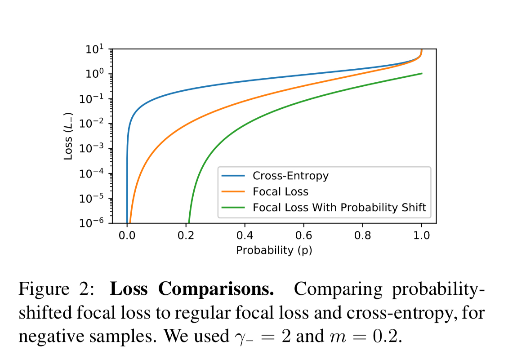

## Title: Asymmetric Loss for Multi Label Classification

이 문서는 논문 "Asymmetric Loss for Multi label classification"을 요약한 문서이다.

### 0. Abstract & Introduction
------------------------

이 논문에서는 multi label classification 문제를 해결하는데 있어서 획기적인 Loss function을 제시한다. 보통, MS-COCO 같은 multi label classification 문제의 경우, 정답이 되는 label보다는 정답이 아닌 label이 훨씬 더 많기 마련이다. 이 논문은 분류 문제에서 흔히 쓰이는 Cross-Entropy나 Focal Loss 같은 Symmetric한 특성을 보이는 Loss function보다는 Asymmetirc한 특성을 보이는 Loss function이 Multi Label Classification에는 더 적합하다고 주장한다.

핵심은, 이 Loss Function은 positive와 negative sample에 대해서 다르게 동작할 수 있게 설계하여 위에서 언급한 label의 imbalance를 해결한다. 다음 사진을 보자.
<center>  </center>

2개의 Positive label이 있고, 78개의 negative label이 있다. 이러한 신경망의 학습을 어렵게 한다는 것이다. 이를 해결하기 위해서는 positive sample과 negative sample에 대해서 비 대칭적인 loss를 적용하여 학습을 진행하는 것이 이번 연구의 주된 아이디어이다.

### 1. Asymmetric Loss
------------------------

#### 1-1. Binary Cross-Entropy & Focal Loss

일단, Binary Cross Entropy(이하 CE)와 Focal Loss(이하 FL)을 간략하게 알아보자.

```math
L = -yL_{+} - (1 - p)L_{-} 
\tag{1}
```
```math
\begin{cases}
    L_{+} = (1-p)^{\gamma}\log(p) \\
    L_{-} = p^{\gamma}\log(p)
\end{cases}

\tag{2}
```
여기서 $y$는 ground truth label이며, $L_{+}$와 $L_{-}$는 각각 positive, negative sample의 loss이다. 그리고 $p$는 신경망의 output인 probability라고 생각해도 된다. 여기서 $\gamma = 0$인 경우가 CE, $\gamma > 0$인 경우가 Focal loss이다. 
이러한 형식으로 positive, negative sample의 loss가 서로 대칭적인 형태를 띄고 있다.  

#### 1-2. Asymmetric Loss

우선 위와는 다르지만, 형태는 크게 달라지지 않는다. 다음을 보자.

```math
\begin{cases}
    L_{+} = (1-p)^{\gamma_{+}}\log(p) \\
    L_{-} = p^{\gamma_{-}}\log(p)
\end{cases}

\tag{3}
```

이렇게 $\gamma_{+}$와 $\gamma_{-}$를 나눠서 positive sample과 negative sample의 hyper parameter를 달리 줌으로써 비대칭성을 실현하였다. positive sample의 영향을 더 높게 쳐주기 위해서 다음과 같은 조건을 주로 사용하기로 했다 $Cond 1: \gamma_{-} > \gamma_{+}$.
자세히 보면 확률은 1보다 작거나 같으므로 더 승수를 크게 주면 Loss를 줄일 수 있다. 이로써 신경망이 positive sample에서 더 의미있는 방향으로 학습을 할 수 있는 것이다. 

논문에서는 이렇게 약한 negative sample이 신경망에 미치는 영향을 줄이는 것을 soft thresholding이라고 한다. 아무래도 negative sample의 신경망에서의 output probability가 낮을 수록 더더욱 신경망에 미치는 영향이 줄어들기 때문이다. 
이것에 더하여 추가적인 비 대칭성을 주는 방법이 있는데, 여기서 제안된 방법은 probability shifting이다. 이는 다음과 같이 threshold $m$보다 output probability가 작을 경우에는 아예 0으로 취급하는 것이다. 다음을 보자.

```math
p_m = \max(p - m, 0)
\tag{4}
```
여기서 $equation \space 4$를 Negative Loss에만 적용하는 것이다. 
결국 이렇게 되면 다음과 같이 최종적인 Asymmetric Loss를 도출할 수 있다.

```math
ASL = 
\begin{cases}

    L_{+} = (1 - p)^{\gamma_{+}}\log(p) \\
    L_{-} = (p_m)^{\gamma_{-}}\log(1 - p_m)

\end{cases}
\tag{5}
```

그리고 여기서 제안하는 $\gamma_{+}$와 $\gamma_{-}$, $m$는 다음과 같다.  
* $\gamma_{+} : 0$
* $\gamma_{-} : 2$
* $m: 0.2$

이랗게 $\gamma_{+}$를 설정하면 positive sample에 대한 loss function은 단순한 cross entropy처럼 동작하게 된다.

이를 그래프로 표현하고 나머지 Loss function들과 비교하면 다음과 같은 figure로 표현 가능하다.

<center>  </center>

#### 1-3. Gradient Analysis

여기서 negative sample의 loss function의 gradient를 직접 계산해서 분석해 보았다. 다음을 보자.

```math
\frac{\partial L_{-}}{\partial z} = \frac{\partial L_{-}}{\partial p} \frac{\partial p}{\partial z} = (p_m)^{\gamma_{-}} \left [ \frac{1}{1 - p_m} - \frac{\gamma_{-}\log(1 - p_m)}{p_m} \right ] p(1 - p)
\tag{6}
```
이때, $p = \frac{1}{1+e^{-z}}$이라고 하자. 일단 분류는 binary라고 정했으니 말이다. multi class에서는 단순히 softmax로 생각해 주면 된다. 이를 이제 시각화 해보면 다음과 같이 표현 가능하다.

<center>  </center>

여기서 PS는 probability shifting이다.

이때 multi label classification에서 나올 수 있는 문제들을 어떻게 해결할 수 있는지 생각해 보면 다음과 같다.

1. Hard-Threshold: 신경망의 출력이 $p < 0.2$이면 그냥 0이 된다. Loss의 Gradient도 0이 되어 신경쓸 필요가 없다.
2. Soft-Threshold: 그래프를 보면 알겠지만, 확률이 어느 정도로 큰 부분만 크게 반영되고 나머지는 거의 0에 가깝다. 이렇게 negative sample의 비중을 줄이는 것이다.
3. MisLabeled: 원래라면 정말 골때리는 경우겠지만 본 연구의 loss를 쓴다면 확률이 큰 negative sample을 어느 정도 채택하여 반영하므로 이러한 경우를 보완할 수 있다고 주장하고 있다. 


#### 1-4. Probability Analysis

본 연구에서는 다른 연구(CE, FL)과의 차별점을 어필하기 위해서 다음과 같은 추가적인 분석을 더했다. 
우선, 확률을 분석하기 위해서 다음과 같이 $p_t$를 정의해 보자.

```math
p_t = 
\begin{cases}
    \bar{p}, & \text{if } \space y = 1 \\
    1 - \bar{p} & \text{otherwise}
\end{cases}
\tag{7}
```

여기서 $\bar{p}$는 1 번의 iteration에서 1개의 batch에서의 확률의 평균이다. 이 평균을 낼때 있어서 positive sample과 negative sample을 나눠서 다음과 같이 따로 $p_t^{+}$, $p_t^{-}$를 정의하자.
이때 다음과 같이 정의된 $\Delta p$를 분석해보자.

```math
\Delta p = p_t^{+} - p_t^{-}
\tag{8}
```
이 값이 작다는 것은 positive sample에 대한 확률이 높고, negative sample에 대한 확률은 낮다는 것이다. 다른 loss와는 다르게 ASL은 이를 획기적으로 줄일 수 있었다. 다음 figure를 보자.

<center>  </center>

보면 ASL은 다른 loss보다는 좋은 성능을 냈다는 것을 알 수 있다.

#### 1-5. Adaptive Asymmetry

이때 우리는 learning rate를 deacy하는 것 처럼 $\gamma$ 또한 iteration이 진행되는 동안 decay하는 방법 또한 제시되어 있다. 그 공식은 다음과 같다.

```math
\gamma_{-} \leftarrow \gamma_{-} + \lambda(\Delta p - \Delta p_{target}) 
\tag{9}
```
여기서 $p_{target}$은 논문에서 0.1으로 정하고 실험을 진행하였다. 그 결과는 다음과 같은 figure로 설명할 수 있다. 

<center>  </center>


### 2. Experiment Result
------------------------

MS-COC를 기준으로 $\gamma_{-}$를 바꿔가며, probability shifting을 적용/미적용 해가며, 결과를 비교해 보았다. 다음 그래프를 보자.

#### 2-1. mAP Vs. Asymmetric Focusing

<center>  </center>

#### 2-2. mAP Vs. Asymmetric Probability Margin

<center>  </center>

#### 2-3. mAP Vs. ASL combination

<center>  </center>

#### 2-4. mAP Vs. Adaptive Asymmetry

<center>  </center>

### 3. ASL experiment with various benchmark dataset
------------------------

이에 관한 결과는 [papers with code](https://paperswithcode.com/task/multi-label-classification)에서 다른 State-of-the-arts 연구들과의 비교 결과를 볼 수 있다. 