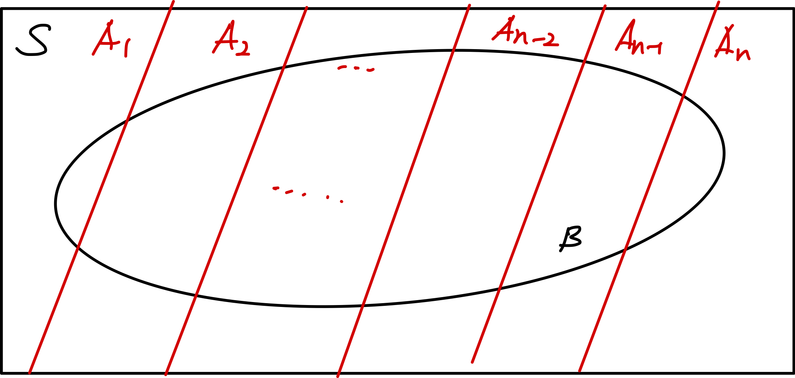

### Set Theory and Set Functions
 

이 파트에서는 우리가 집합과 집합에 대한 함수를 어떻게 정의하는지를 다루게 된다. 집합이란, 하나의 묶음 또는 모임(collection)을 뜻한다. 이는 특정 단위도, 연산도 정의가 안된 그냥 하나의 객체라고 봐도 무방하다. 이에 대한 여러 연산 및 대응 관계를 우리가 정의함으로써, 그 의미를 가진다. 이에 대한 자세한 설명은 앞으로 $\sigma$ -field를 하면서 천천히 다룰 예정이다.

대표적인 집합 연산의 예시들이 있지만, 고등학생때 다루었던 내용을 제외하고 여기선은 집합 함수에 대하여 논의해 보고자 한다. 함수란, 일종의 대응 관계를 뜻하는 것인데 여기서 집합 함수란, 집합에 대한 특정한 대응 관계를 함수로 정의할 수 있으면 그것을 집합 함수라고 한다. 여기서는 집합을 적분으로 정의할 수 있다는 것만 알아둬도 될 것 같다.
$$
C = \{x| a \leq x \leq b \} \\
\int_C f(x) dx = \int^{b}_a f(x)dx
\tag{1}
$$

 

### Conditional Probability & Independent Event

 

이 파트에서는 조건부 확률과 베이즈 정리를 다루도록 하겠다. 조건부 확률이란 어떤 사건이 일어남을 전제로 하고 다른 사건이 일어날 확률을 구하는 것을 의마한다. 수학적인 표현 및 정의는 다음과 같다.

$$
P(A|B) = \frac{P(A\cap B)}{P(B)}
$$

이러한 조건부 확률은 다음과 같은 특성을 가진다.
 

$$
P(B|A) \geq 0
\tag{1}
$$
$$
P(A|A) = 1
\tag{2}
$$
$$
i \neq j, B_i \cap B_j = \empty \\
P(\cup ^ {\infty}_{n=1}B_n | A) = \Sigma ^{\infty}_{n=1} P(B_n | A)
\tag{3}
$$
이는 당연한 공리로써, 조금만 생각해보면 바로 증명할 수 있다. 굳이 이를 여기에 구구 절절 설명하지는 않겠다.

그리고 다음에 이를 이용하여 매우 중요하고 재미있는 정리가 등장한다. 바로 *배이즈 정리*이다. 다음과 같은 밴다이어그램이 있다고 가정하자. 이때의 조건부 확률을 구하는 방법을 설명하도록 하겠다.

여기서 우리는 $P(A_i|B)$를 알고 싶다고 가정하자. 그리고 우리가 이미 $P(A_i)$는 알고 있다고 가정을 하는 것이다. 그렇다면 우리는 다음과 같이 $P(B)$를 구할 수 있다.

$$
P(B) = \Sigma^{n}_{i = 1}P(A_i)P(B|A_i)
$$
그렇다면 우리는 다음과 같이 $P(A_i|B)$를 구할 수 있다.

$$
P(A_k|B) = \frac{P(A_k)P(B|A_k)}{\Sigma^{n}_{i = 1}P(A_i)P(B|A_i)}
$$
이를 베이즈 정리라고 한다. 여기에서, $P(A_i)$를 사전 확률, $P(A_i|B)$를 사후 확률이라고 정의한다.

그리고 두 사건이 독립이라는 뜻은 두 사건이 서로 일어나는 확률에 영향을 미치지 않는다는 뜻이다. 이는 수식으로 표현하면 다음과 같다.
$$
P(B|A) = P(B)
$$
이의 결과로써, 서로 다른 두 사건, A와 B에 대하여 다음이 성립한다.
$$
P(A \cap B) = P(A)P(B)
$$
이를 이용하여 다양한 문제제를 해결할 수 있다.

 

### Random Variables

랜덤 변수, Random Variable은 일종의 함수이다. 정의를 제세히 말하면 다음과 같다.

표본 공간 $S$가 있다고 했을때, 이의 각 원소를 실수로 대응시키는 함수, 
$$
s \in S \\
X(s) = x
$$
를 만족 시키는 함수이다. 이때 이 Random Variable은 연속일 수도 있고 이산일 수도 있다. 이때 이를 확률로써 유도할 수 있는 함수를 "분포(distribution)"이라고 한다. 이러한 분포는 여러 형태가 있는데, 그것들에 대해서는 나중에 알아보도록 하겠다. 이때, 이러한 변수의 형태에 따라 어떤 함수의 형태가 있는지 나열해보면

* 확률 질량 함수, Probabaility Mass Function
* 확률 밀도 함수, Probability Density Function
이 2가지가 있다. 이러한 2가지 형태를 적분/누적 합 한 함수를 누적 분포 함수(Cumulative Distribution Function)이라고 하며, 실질적으로 확률로 정의되는 함수는 이 함수이다. (물론 질량 함수의 함수값도 확률이다. 이는 나중에 다룬다.)
이러한 누적 분포 함수의 정의는 다음과 같다.

$$
F_X(x) = P_X(X \leq x) = P([-\infty, x])
$$
이 함수의 성질은 여러가지가 있는데 간략히 간츄려 보자면 다음과 같다.

$$
\forall a, b \rightarrow a < b, F(a) < F(b)
\tag{1} 
$$

$$
\lim_{x \rightarrow \infty} F(x) = 1
\tag{2} 
$$

$$
\lim_{x \rightarrow -\infty} F(x) = 0
\tag{3} 
$$

$$
\lim_{x \downarrow x_0} F(x) = F(x_0)
\tag{3} 
$$

이 정도의 지식을 가지고, 우리는 앞으로 어떤 분포가 있는지, 어떤 연산이 가능한지를 살펴 보도록 하겠다.