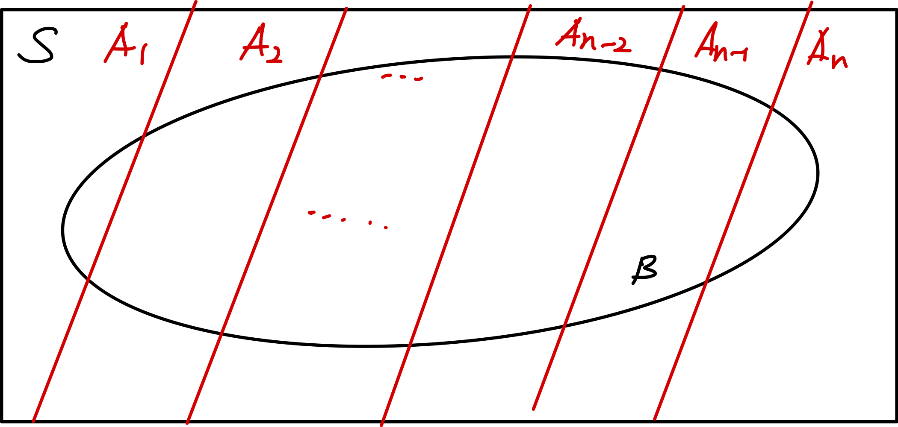

### Set Theory and Set Functions
 
이 파트에서는 우리가 집합과 집합에 대한 함수를 어떻게 정의하는지를 다루게 된다. 집합이란, 하나의 묶음 또는 모임(collection)을 뜻한다. 이는 특정 단위도, 연산도 정의가 안된  

 

### Conditional Probability & Independent Event

 

이 파트에서는 조건부 확률과 베이즈 정리를 다루도록 하겠다. 조건부 확률이란 어떤 사건이 일어남을 전제로 하고 다른 사건이 일어날 확률을 구하는 것을 의마한다. 수학적인 표현 및 정의는 다음과 같다.

$$
P(A|B) = \frac{P(A\cap B)}{P(B)}
$$

이러한 조건부 확률은 다음과 같은 특성을 가진다.
 

$$
P(B|A) \geq 0
\tag{1}
$$
$$
P(A|A) = 1
\tag{2}
$$
$$
i \neq j, B_i \cap B_j = \empty \\
P(\cup ^ {\infty}_{n=1}B_n | A) = \Sigma ^{\infty}_{n=1} P(B_n | A)
\tag{3}
$$
이는 당연한 공리로써, 조금만 생각해보면 바로 증명할 수 있다. 굳이 이를 여기에 구구 절절 설명하지는 않겠다.

그리고 다음에 이를 이용하여 매우 중요하고 재미있는 정리가 등장한다. 바로 *배이즈 정리*이다. 다음과 같은 밴다이어그램이 있다고 가정하자. 이때의 조건부 확률을 구하는 방법을 설명하도록 하겠다.

여기서 우리는 $P(A_i|B)$를 알고 싶다고 가정하자. 그리고 우리가 이미 $P(A_i)$는 알고 있다고 가정을 하는 것이다. 그렇다면 우리는 다음과 같이 $P(B)$를 구할 수 있다.

$$
P(B) = \Sigma^{n}_{i = 1}P(A_i)P(B|A_i)
$$
그렇다면 우리는 다음과 같이 $P(A_i|B)$를 구할 수 있다.

$$
P(A_k|B) = \frac{P(A_k)P(B|A_k)}{\Sigma^{n}_{i = 1}P(A_i)P(B|A_i)}
$$
이를 베이즈 정리라고 한다. 여기에서, $P(A_i)$를 사전 확률, $P(A_i|B)$를 사후 확률이라고 정의한다.

그리고 두 사건이 독립이라는 뜻은 두 사건이 서로 일어나는 확률에 영향을 미치지 않는다는 뜻이다. 이는 수식으로 표현하면 다음과 같다.
$$
P(B|A) = P(B)
$$
이의 결과로써, 서로 다른 두 사건, A와 B에 대하여 다음이 성립한다.
$$
P(A \cap B) = P(A)P(B)
$$
이를 이용하여 다양한 문제제를 해결할 수 있다.

 

### Random Variables