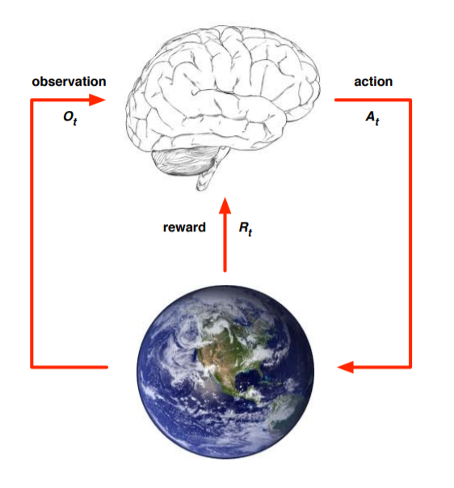

## Title: Reinforcement Learning Basic
-----------------------------------------------------------------------------------

이 문서는 강화학습의 기본을 정리하는 문서이다. 겸사겸사 markdown의 작성법에도 익숙해 지려고 한다.
기본적으로 강화학습이 해결할 수 있는 문제는 간단히 생각해서 다음 사진과 같다.

위의 그림의 요약은 우리가 모르는 미지의 환경과 에이전트간의 상호 작용이다.
그렇다면 이를 어떻게 학습으로 이어질 수 있게 하겠는가?
이에 대한 흐름은 다음과 같이 표현 가능하다.

------------------------------------------------------------------
> (1) 이 agent는 이산 시간마다 $x_t$라는 자신의 상태를 측정하게 된다.
> (2) 측정한 상태 $x_t$에서 Agent의 정책에 따라서 Action $u_t$를 선택하여 환경에게 인가한다.
> (3) 행동에 의하여 환경은 Agent를 다음 상태인 $x_{t+1}$로 상태 전이(State Transition)를 한다.
> (4) 새로운 상황에 대해서 새로운 Action($u_{t+1}$)을 도출해 낸다.
> (5) 전환된 환경에서 주어지는 보상($r_{t+1}$)을 받는다. 그 후에 장기적인 보상의 합을 통해서 정책을 즉시 또는 주기적으로 개선한다.
> (6) 계속  반복한다.  
----------------------------------------------------------------------

이러한 Process를 수학적으로 모델링한 것이 바로 *Markov Decision Process*라고 한다.

이러한 강화학습은 큰 틀에 3가지 방법론이 있다. 이는 강화학습의 큰 3가지 틀이다.
 앞으로는 이러한 3가지 틀의 연장선으로써 다양한 알고리즘을 공부할 것이다.

이 3가지 틀은 다음과 같다.
1. Value Function을 추정하는가?
2. Policy를 어떻게 개선할 것인가?
3. Environment model을 추정하는가?

이 3가지 틀에는 다음과 같은 공통점이 있다.

  
*(출처: 수학으로 풀어보는 강화학습 원리와 알고리즘, 저: 박성수)*  
이에 대한 방법론으로 나오는 것이 위의 3가지 부류이다.

### 1. Value Function을 추정하는가? (Value-Based RL)
-------------------------------------------------
이 방법은 어떤 상태에서 행동을 할때 미래에 까지 얻을 수 있는 총 보상을 추정하는 함수를 구하는 방법이다. 구체적인 용어는 나중에 차차 알아가도록 하자. 우리는 이 방법으로 각 상태에서의 최선의 action을 취하는 함수를 추정해 나가는 것이 이 방법의 목적이 된다.

  

*(출처: 수학으로 풀어보는 강화학습 원리와 알고리즘, 저: 박성수)*  

### 2. Policy를 어떻게 개선할 것인가? (Policy Gradient)
-------------------------------------------------
이 방법은 정책을 직접 유도하는 방식이다. 이는 정책을 직접 탐색하여 최선의 정책을 찾는 것을 목표로 하고 있다. 이는 앞으로 받을 보상의 기댓값을 최대로 하는 정책의 parameter($\theta$)를 직접 Gradient ascent로 계산하는 방식이다. 이 방식을 대체적으로 Policy Gradient라고 부른다.

  

*(출처: 수학으로 풀어보는 강화학습 원리와 알고리즘, 저: 박성수)*  

### 3. Environment model을 추정하는가? (Model-Based RL)
-------------------------------------------------
위의 2가지 방식은 환경이 미지였으나 여기서는 "환경 모델"을 추정하는 방식이다. 이는 위의 2가지 방식과는 다르게 간단하고 효율적이기에 로봇 제어나 드론 제어에 많이 사용되고 있다.

  

*(출처: 수학으로 풀어보는 강화학습 원리와 알고리즘, 저: 박성수)*  

앞으로의 게시글에서 이러한 3개의 모델의 각 알고리즘들을 소스코드와 함께 다뤄볼 것이다.
1, 2, 3의 순서대로 다룰 예정이며 다양한 논문과 CS234, David Sliver의 강의, 수학으로 풀어보는 강화학습 원리와 알고리즘이 주요한 레퍼런스가 될 예정이다.
